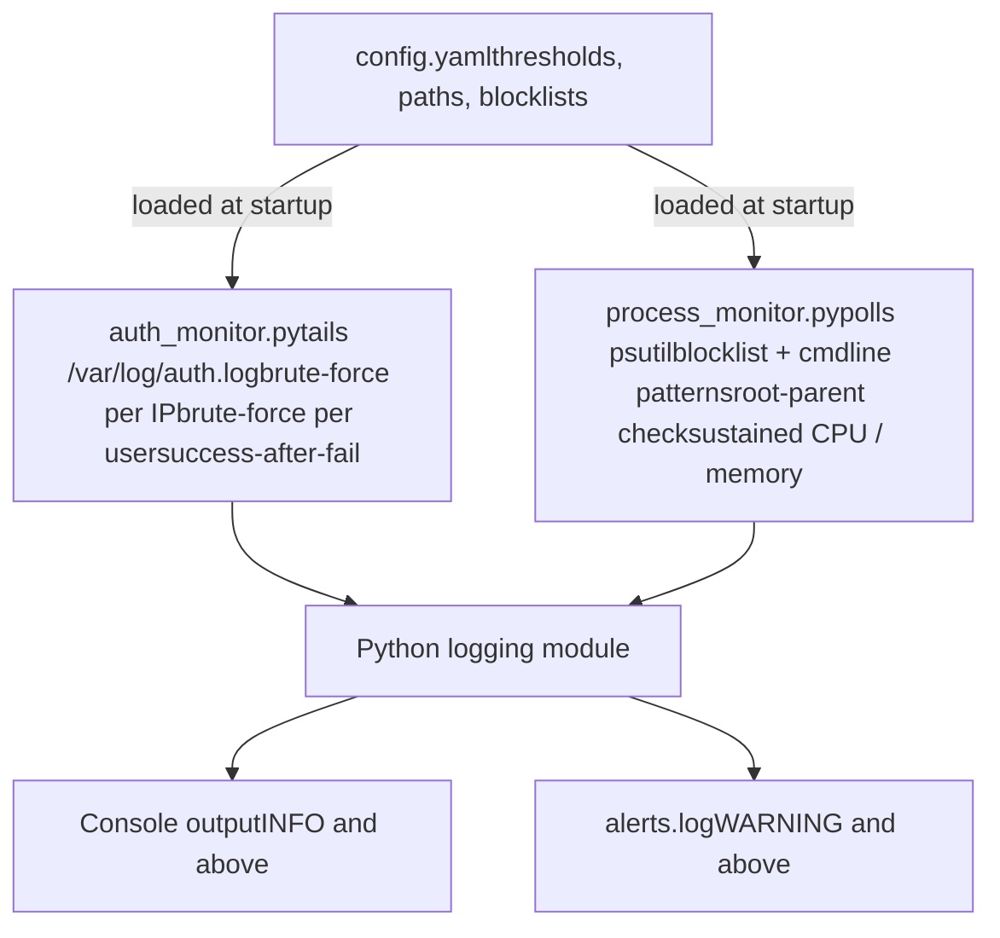

# Simple Intrusion Detection System (HIDS)

[](https://www.python.org/downloads/)
[](https://ubuntu.com/)
[](https://ubuntu.com/)
[](https://opensource.org/licenses/MIT)
[](#)

A host-based intrusion detection system written in Python. Continuously monitors a Linux host for unusual authentication activity and suspicious process behaviour, and writes prioritised alerts to a persistent log file.

## Academic Use & Consent Statement

This project is **academic lab work** submitted for an Information Security course. It is intended **strictly for educational purposes**, within an isolated virtual machine that the author owns and controls.

- The IDS was developed and tested only against a personal Ubuntu 24.04 virtual machine running under UTM on the author's own computer.
- All verification activity (failed SSH logins, manual process launches, etc.) was performed by the author against the author's own VM, with full consent and authorisation.
- The IDS was **not** deployed against, tested on, or directed at any third-party system, network, or service.
- No real user data, credentials, or production logs were collected, processed, or shared.

Anyone reusing this code is responsible for ensuring their own use remains within applicable laws and institutional policies. Running an IDS on systems you do not own, or do not have explicit written permission to monitor, may violate computer-misuse and privacy laws in your jurisdiction.

## Table of Contents

- [Project Description and Problem Statement](#project-description-and-problem-statement)
- [Architecture Overview](#architecture-overview)
- [Tech Stack](#tech-stack)
- [Project Structure](#project-structure)
- [Setup and Run Instructions](#setup-and-run-instructions)
- [Detection Rules Reference](#detection-rules-reference)
- [Configuration Reference](#configuration-reference)
- [Screenshots and Demo](#screenshots-and-demo)
- [Manual Verification of Detections](#manual-verification-of-detections)
- [Pitch Presentation](#pitch-presentation)
- [Demo Video](#demo-video)
- [Faculty Feedback](#faculty-feedback)
- [Troubleshooting](#troubleshooting)
- [Limitations and Future Work](#limitations-and-future-work)
- [References](#references)

## Project Description and Problem Statement

**Simple Intrusion Detection System (HIDS)** is a small but realistic host-based intrusion detection system for Linux. It addresses the critical need for *real-time visibility into authentication abuse and suspicious process activity* on a single host — the two most common indicators of an active intrusion attempt against a server.

### Problem It Solves

In modern infrastructure, an unmonitored Linux host is blind to:

- **Brute-force authentication attacks** against SSH, often the first step of a compromise.
- **Distributed brute-force attacks** that rotate source IPs to evade per-IP rate limits.
- **Successful logins after suspicious failure bursts** — the case that matters most, because it indicates the attacker may already be inside.
- **Suspicious processes** spawned by attackers after an initial foothold: reverse shells (`bash -i`, `nc -e`), reconnaissance tooling (`nmap`, `tcpdump`), credential-attack tools (`hydra`, `hashcat`, `mimikatz`).
- **Privilege anomalies** — root-owned processes spawned by unexpected parents, a classic privilege-escalation signature.
- **Resource anomalies** sustained over time — the cryptominer signature.

This project provides a small, readable IDS that:

- Watches `/var/log/auth.log` and the running process table in real time.
- Applies signature-, threshold-, and baseline-based detection strategies.
- Persists prioritised alerts to a structured log file for review.
- Is fully configurable through a single YAML file — no code changes required to tune thresholds, rules, or blocklists.

### Target Audience

- Information Security students learning host-based detection.
- System administrators wanting a minimal, transparent monitor on a single Linux host.
- Anyone evaluating the *thinking* behind real IDS tools (OSSEC, Wazuh, fail2ban) without the production complexity.

## Architecture Overview

### System Architecture Diagram



### Core Components

1. **Auth Monitor** (`auth_monitor.py`)
   - Tails `/var/log/auth.log` in real time, never missing events between reads.
   - Sliding-window brute-force detection per source IP and per username.
   - Sensitive-user escalation (`root`, `admin`, ...) to CRITICAL severity.
   - Successful-login-after-failures detection — the highest-impact rule, because it identifies a brute-force that may have *succeeded*.
   - Cooldown logic prevents alert floods on long-running attacks while still surfacing them periodically.

2. **Process Monitor** (`process_monitor.py`)
   - Snapshot-and-diff process baseline via `psutil.process_iter()`.
   - Suspicious-binary blocklist for offensive tooling.
   - Regex-based command-line pattern matching for reverse shells and obfuscated payloads.
   - Privilege-anomaly detection: root processes spawned by untrusted parents.
   - Sustained CPU and memory anomaly detection over a rolling window.

3. **Configuration** (`config.yaml`)
   - One file, two sections (`auth:` and `process:`), one shared section.
   - Tune any threshold, window, blocklist, or pattern without editing code.

4. **Alert Sink** (`alerts.log` plus Python `logging`)
   - Console handler at the configured verbosity level.
   - File handler at `WARNING+` for a clean, greppable audit trail.
   - Each line tagged `[auth]` or `[proc]` so the source sensor is unambiguous.

### Data Flow Process

1. **Configuration load** — `config.yaml` is read by both monitors at startup.
2. **Event ingestion** — auth monitor tails the auth log; process monitor polls `psutil` every `poll_seconds`.
3. **Parsing and normalisation** — auth lines are matched against `Failed password` and `Accepted password` regexes; processes are captured as structured dicts.
4. **Detection** — sliding windows, signature lookups, baseline diffs, resource averages.
5. **Severity assignment** — INFO / WARNING / CRITICAL according to the rule and the configured sensitive-user list.
6. **Logging** — every event hits the console; only WARNING+ are persisted to `alerts.log`.
7. **Cooldown and re-arming** — repeat alerts on the same key are suppressed for `cooldown_seconds`, then re-armed.

## Tech Stack

### Core

- **Python 3.10+** — implementation language (tested on Python 3.12).
- **`psutil` >= 5.9** — cross-platform process / CPU / memory / network enumeration.
- **`PyYAML` >= 6.0** — configuration loading.
- **Standard library** — `re`, `logging`, `datetime`, `collections`, `pathlib`, `time`.

### Operating System and Logging

- **Ubuntu 24.04 LTS (ARM64)** — primary lab environment.
- **`rsyslog`** — ensures `/var/log/auth.log` is populated (newer Ubuntu Desktop ships with journald-only by default).
- **OpenSSH server** — provides the auth events the auth monitor detects.

### Virtualisation

- **UTM** (macOS) — provides the lab VM.
- **QEMU** — backing hypervisor used by UTM.

### Development Tools

- `git` — version control.
- `nano` and VS Code (Remote-SSH) — editors.
- Python `venv` — dependency isolation.

### Key Features Enabled by the Tech Stack

- **Real-time tailing** — file-offset bookkeeping for log lines.
- **Cross-process introspection** — `psutil` exposes parent PIDs, command lines, UIDs, CPU and memory stats.
- **Configurable detection** — YAML lets the operator iterate on rules in seconds.
- **Structured persistence** — Python `logging` provides timestamped, level-tagged audit lines.

## Project Structure

```text
infosec-final/
├── auth_monitor.py        # Sensor 1: SSH auth log monitor
├── process_monitor.py     # Sensor 2: process monitor
├── config.yaml            # Tunable rules and thresholds
├── requirements.txt       # Python dependencies
├── run_all.sh             # Convenience launcher for both sensors
├── alerts.log             # Persistent alert log (created at runtime)
├── .gitignore
├── README.md              # This file
└── venv/                  # Python virtual environment (not committed)
```

**Key files:**

- `auth_monitor.py` — auth-log tail loop, regex parsing, sliding-window detector, severity dispatch.
- `process_monitor.py` — periodic `psutil` snapshot, baseline diff, rule application.
- `config.yaml` — every threshold, window, blocklist, and pattern.
- `run_all.sh` — starts both monitors and tails `alerts.log` in one terminal.

## Setup and Run Instructions

### Prerequisites

**Required:**

- **Python 3.10+** (3.12 recommended)
- **Linux host** — Ubuntu 24.04 LTS recommended, ARM64 or AMD64.
- `git` for cloning.

**Strongly recommended for verification:**

- A **second machine** (or your host OS) on the same network as the lab VM, to generate failed SSH logins.

### Installation Steps

#### 1. Clone the repository

```bash
git clone https://github.com//infosec-final.git
cd infosec-final
```

#### 2. Set up the Python virtual environment

```bash
python3 -m venv venv
source venv/bin/activate
pip install -r requirements.txt
```

#### 3. Ensure auth.log is being written

Ubuntu 24.04 Desktop sometimes ships without traditional syslog. To guarantee the auth log exists:

```bash
sudo apt install -y rsyslog
sudo systemctl enable --now rsyslog
```

#### 4. Ensure SSH server is running

Required so the auth monitor has events to detect:

```bash
sudo apt install -y openssh-server
sudo systemctl enable --now ssh
```

### Running the Application

#### Option A — Manual Startup (three-terminal approach, recommended for development)

**Terminal 1 — auth monitor:**

```bash
sudo venv/bin/python3 auth_monitor.py
```

`sudo` is required because `/var/log/auth.log` is root-readable. The explicit `venv/bin/python3` path ensures `sudo` runs the virtual-environment Python (with `pyyaml` available) rather than the system Python.

Expected output:

```text
2026-05-05 15:00:01 [INFO    ] [auth] Watching /var/log/auth.log
2026-05-05 15:00:01 [INFO    ] [auth] Rules: per-IP 5 fails / 60s | per-user 10 fails / 300s | cooldown 600s
2026-05-05 15:00:01 [INFO    ] [auth] Alerts also written to /home//infosec-final/alerts.log
```

**Terminal 2 — process monitor:**

```bash
venv/bin/python3 process_monitor.py
```

**Terminal 3 — watch alerts:**

```bash
tail -f alerts.log
```

#### Option B — One-Command Startup

```bash
./run_all.sh
```

Launches both monitors as background jobs and tails `alerts.log` in the foreground. Press `Ctrl+C` to stop everything cleanly.

### Configuration Options

All behaviour is tuned in `config.yaml`. Quick examples:

```yaml
# Relax per-IP detection during testing
auth:
  ip_threshold: 3
  ip_window_seconds: 30
  cooldown_seconds: 30

# Tighten resource-anomaly thresholds
process:
  cpu_threshold_percent: 50
  resource_window_seconds: 15

console_level: DEBUG
```

After editing, restart the affected monitor for changes to take effect.

## Detection Rules Reference

### Auth Monitor

| Rule | Trigger | Severity |
|------|---------|----------|
| Per-IP brute-force | At least `ip_threshold` failed logins from one IP within `ip_window_seconds`. | WARNING |
| Per-user brute-force | At least `user_threshold` failures targeting one user within `user_window_seconds`. | WARNING |
| Per-user on sensitive user | Same as above, but username is in `sensitive_users`. | **CRITICAL** |
| Possible compromise | `Accepted password` from an IP that has recent failures. | **CRITICAL** |

### Process Monitor

| Rule | Trigger | Severity |
|------|---------|----------|
| Blocklisted binary | A new process whose name is in `process_blocklist`. | **CRITICAL** |
| Suspicious cmdline pattern | A new process whose cmdline matches a regex in `cmdline_patterns`. | **CRITICAL** |
| Untrusted-parent root process | A new root-owned process whose parent is not in `trusted_root_parents`. | WARNING |
| Sustained high CPU | Average CPU% over `resource_window_seconds` is at least `cpu_threshold_percent`. | WARNING |
| Sustained high memory | Average RSS over `resource_window_seconds` is at least `memory_threshold_mb` (MB). | WARNING |

## Configuration Reference

| Key | Sensor | Purpose |
|-----|--------|---------|
| `alert_log` | shared | Path to the persistent alert log. |
| `console_level` | shared | Console verbosity (DEBUG / INFO / WARNING / ERROR / CRITICAL). |
| `auth.log_path` | auth | Auth log file to tail. |
| `auth.ip_window_seconds` | auth | Sliding window for per-IP failure counting. |
| `auth.ip_threshold` | auth | Per-IP failures within window that trigger an alert. |
| `auth.user_window_seconds` | auth | Sliding window for per-user failure counting. |
| `auth.user_threshold` | auth | Per-user failures within window that trigger an alert. |
| `auth.cooldown_seconds` | auth | Minimum gap between repeat alerts on the same key. |
| `auth.sensitive_users` | auth | Usernames whose attempts are escalated to CRITICAL. |
| `process.poll_seconds` | process | Snapshot interval. |
| `process.resource_window_seconds` | process | Window over which CPU/mem averages are computed. |
| `process.cpu_threshold_percent` | process | Sustained CPU% that triggers an alert. |
| `process.memory_threshold_mb` | process | Sustained RSS (MB) that triggers an alert. |
| `process.process_blocklist` | process | Process names that always trigger an alert on first sighting. |
| `process.cmdline_patterns` | process | Regex patterns matched against full command line. |
| `process.cooldown_seconds` | process | Minimum gap between repeat alerts on the same key. |
| `process.trusted_root_parents` | process | Parents that are *not* suspicious for root-owned children. |

## Screenshots and Demo

> *Placeholder section. Replace each entry below with a screenshot of your IDS in action.*

### Auth Monitor — Brute-Force Alert

``

*The auth monitor detects 5 failed logins from a single source IP within 60 seconds and emits a `BRUTE-FORCE (per-IP)` WARNING. The alert is also persisted to `alerts.log`.*

### Auth Monitor — Possible Compromise

``

*A successful `Accepted password` event arrives from an IP that had recent failed attempts. The auth monitor escalates this to CRITICAL.*

### Process Monitor — Blocklisted Binary

``

*Spawning `nc` triggers a CRITICAL alert because `nc` is in the configured `process_blocklist`.*

### Process Monitor — Suspicious Cmdline

``

*A process started with `bash -i` matches the reverse-shell pattern in `cmdline_patterns` and is flagged CRITICAL.*

### Persistent Alert Log

``

*The structured alert log retains every WARNING and CRITICAL event with timestamp, severity, sensor tag (`[auth]` and `[proc]`), and message body.*

## Manual Verification of Detections

Each detection rule is verified by performing the corresponding action manually **against the author's own lab VM only** and observing the resulting alert in `alerts.log`. Verification is intentionally a hands-on operator activity — there is no automated attack-simulation tool shipped with this project.

In the examples below, replace `192.168.64.X` with the VM's current IP from `hostname -I`.

### Auth Monitor — Test 1: Per-IP Brute Force

From the host (or another machine on the same LAN):

```bash
ssh nur@192.168.64.X
# enter wrong password 5+ times
```

Expected: `WARNING BRUTE-FORCE (per-IP)` in `alerts.log` once the threshold is crossed.

### Auth Monitor — Test 2: Per-User Brute Force on a Sensitive Account

```bash
ssh root@192.168.64.X
# enter wrong passwords
```

Expected: `CRITICAL BRUTE-FORCE (per-user)` because `root` is in `sensitive_users`.

### Auth Monitor — Test 3: Successful Login After Failures

Trigger several wrong-password attempts, then SSH in successfully:

```bash
ssh nur@192.168.64.X
# wrong, wrong, wrong... then the correct password
```

Expected: `CRITICAL POSSIBLE COMPROMISE`.

### Auth Monitor — Test 4: Cooldown and Re-arming

Trigger one brute-force burst and observe the alert. Within the cooldown window, additional failures should *not* produce duplicate alerts. After the cooldown elapses, fresh failures should produce a new alert.

### Process Monitor — Test 5: Blocklisted Binary

In a VM terminal:

```bash
nc -h
```

Expected: `CRITICAL BLOCKLISTED BINARY`.

### Process Monitor — Test 6: Suspicious Command Line

```bash
bash -i
exit
```

Expected: `CRITICAL SUSPICIOUS CMDLINE` matching `bash\s+-i`.

### Process Monitor — Test 7: Sustained CPU

```bash
yes > /dev/null &
# wait ~35 seconds (longer than resource_window_seconds)
kill %1
```

Expected: `WARNING SUSTAINED HIGH CPU`.

### Process Monitor — Test 8: Root with Untrusted Parent

```bash
sudo bash -c 'sleep 60' &
```

Expected (after the next snapshot): `WARNING ROOT PROCESS WITH UNTRUSTED PARENT`.

## Pitch Presentation

- Slides link: `[Add PPT/PDF link here]`

The presentation should cover:

- Problem and motivation — why a small HIDS matters even alongside mature tools.
- The two sensors and what each catches.
- Detection strategy: signature, threshold, baseline.
- Severity model and alert routing.
- Demo and results.
- Limitations and what a production-grade IDS would add.

## Demo Video

- Demo link: `[Add YouTube or Google Drive link here]`

Recommended walkthrough:

1. Start both monitors via `./run_all.sh`.
2. From a second machine, generate failed SSH logins and watch the per-IP and per-user alerts fire.
3. Successfully SSH in to demonstrate the "possible compromise" alert.
4. In the VM, run `nc -h` and `bash -i` to demonstrate the process monitor's blocklist and cmdline-pattern rules.
5. Run a sustained-CPU workload and watch the resource-anomaly alert appear after the rolling window fills.
6. `cat alerts.log` to show the persistent audit trail.

## Faculty Feedback

- Feedback video link: `[Add YouTube or Google Drive link here]`

Reminder:

- One approved professor should appear on camera.
- Feedback should be objective and based on the project walkthrough.

## Troubleshooting

### auth.log does not exist

```bash
sudo apt install -y rsyslog
sudo systemctl enable --now rsyslog
```

### SSH connection refused from the host

```bash
sudo systemctl status ssh
sudo systemctl enable --now ssh
```

### Stale host key warning when reconnecting

Run on the host (not the VM):

```bash
ssh-keygen -R 192.168.64.X
```

### Cannot reach the VM

```bash
ping 192.168.64.X
nc -zv 192.168.64.X 22
```

In UTM, confirm the VM's network is set to **Shared Network**.

### VM IP changed between sessions

UTM's DHCP can reassign IPs after reboot. Run `hostname -I` inside the VM and update host-side entries (SSH config, VS Code Remote-SSH host, etc.).

### sudo: venv/bin/python3: command not found

You're not in the project directory. Run:

```bash
cd ~/infosec-final
```

### Permission denied reading auth.log

`auth_monitor.py` must be launched with `sudo`.

### Process monitor sees no `[NEW]` events

The first snapshot is silent on purpose — it establishes the baseline. Spawn a new process *after* startup completes and you'll see `[NEW]` events in the console.

## Limitations and Future Work

This IDS is a learning project, not production software. Known limitations:

- **Host-based only.** Cannot see attacks against other hosts on the network.
- **Signature-based detection** is blind to novel attacker tooling renamed or recompiled to evade the blocklist.
- **No persistence beyond a single process lifetime.** Sliding windows reset on restart.
- **Auth-log timestamps lack a year.** The traditional syslog format omits the year; the IDS assumes the current year.
- **Process polling has an inherent blind spot.** Very short-lived processes that exit between snapshots are missed. Production tools use `auditd` or eBPF.
- **No alert delivery channels** beyond console and `alerts.log`.

Planned future improvements:

- File integrity monitoring (`/etc/passwd`, `/etc/shadow`, `/etc/sudoers`, `~/.ssh/authorized_keys`).
- SQLite event store for retrospective queries across restarts.
- GeoIP and threat-intel (AbuseIPDB) enrichment of attacking IPs.
- Flask dashboard for live alert visualisation.
- Desktop and webhook notification channels (Telegram, Discord).
- `systemd` unit so the IDS runs as a real service.

## References

- `psutil` documentation — <https://psutil.readthedocs.io>
- OSSEC HIDS — <https://www.ossec.net>
- Wazuh — <https://documentation.wazuh.com>
- *Applied Network Security Monitoring*, Chris Sanders & Jason Smith
- *How Linux Works*, Brian Ward
- Ubuntu syslog / journald docs — <https://ubuntu.com/server/docs>
- SANS Reading Room (HIDS papers) — <https://www.sans.org/white-papers>

---

**Author:** *Nurkyz Sydykbekova*

**Course:** Information Security — final project
