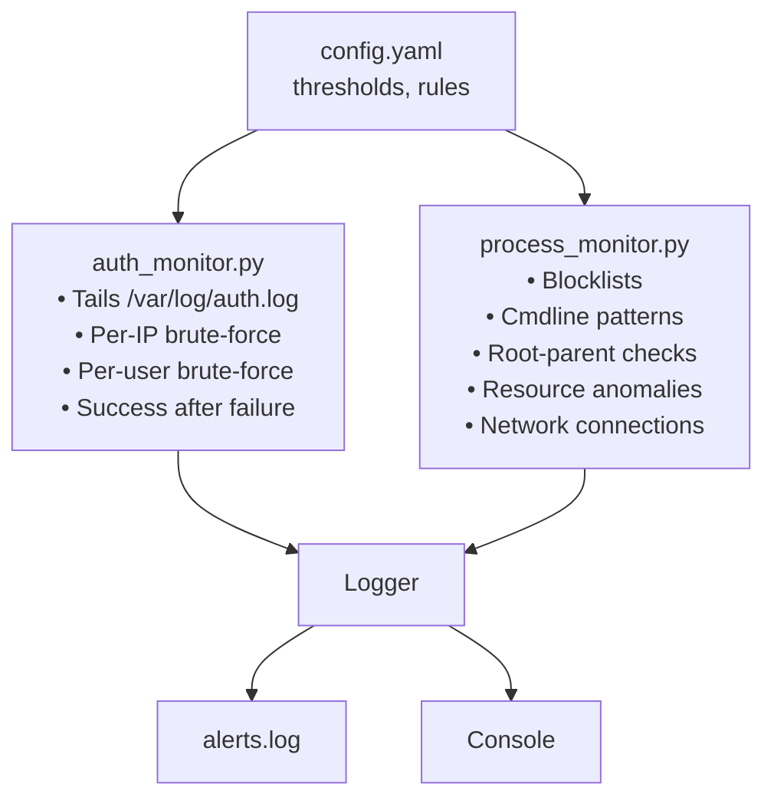
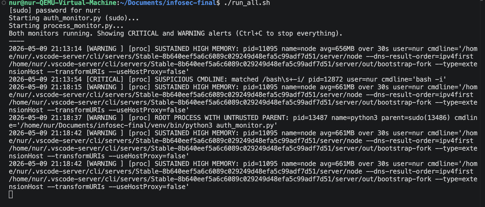
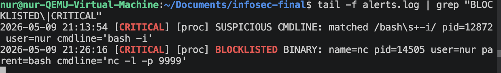
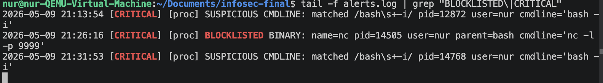
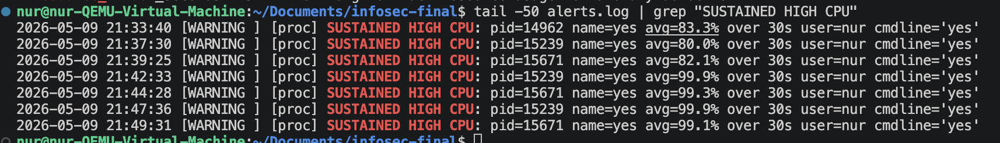
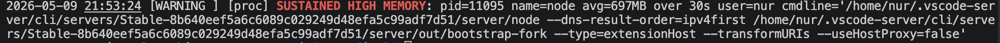
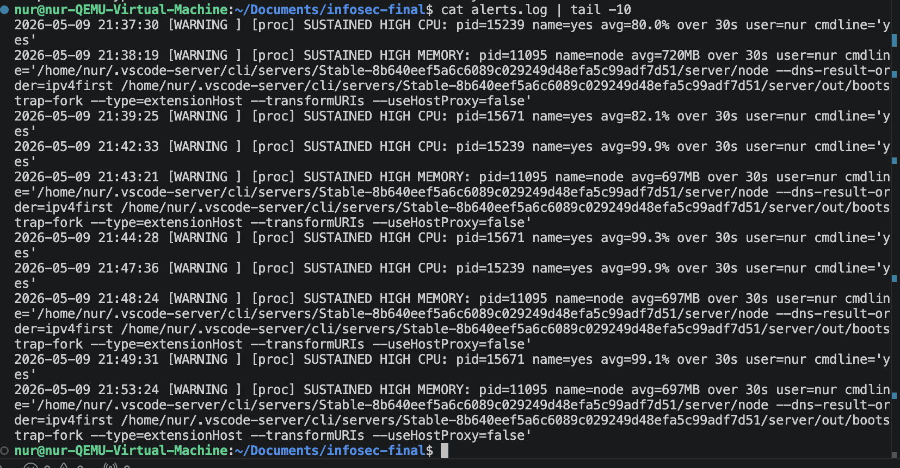

# Simple Intrusion Detection System (HIDS)

[](https://www.python.org/downloads/)
[](https://ubuntu.com/)
[](https://ubuntu.com/)
[](https://opensource.org/licenses/MIT)

A host-based intrusion detection system (HIDS) written in Python. Continuously monitors a Linux host for authentication abuse and suspicious process activity, writing prioritised alerts to a persistent log file.

## Academic Use & Consent

**Strictly for educational purposes** on an isolated VM. Not deployed against third-party systems. Reusers are responsible for ensuring compliance with local laws and policies.

## Table of Contents

- [Project Description](#project-description)
- [Architecture Overview](#architecture-overview)
- [Tech Stack](#tech-stack)
- [Setup & Run](#setup--run-instructions)
- [Testing with Two Machines](#testing-with-two-machines)
- [Screenshots](#screenshots--diagrams)

## Project Description

### Problem It Solves

An unmonitored Linux host is blind to:
- **Brute-force SSH attacks** — most common entry point
- **Distributed attacks** — rotating IPs to evade per-IP rate limits
- **Successful logins after failures** — strongest breach indicator
- **Suspicious processes** — reverse shells, reconnaissance tools, credential attacks
- **Privilege anomalies** — root-owned processes from untrusted parents
- **Resource anomalies** — cryptominers, runaway processes
- **Network anomalies** — outbound connections from shells to external IPs

### Solution

This HIDS:
- Monitors `/var/log/auth.log` and running processes in real time
- Uses signature, threshold, and baseline-based detection
- Writes alerts with timestamps and severity to `alerts.log`
- Fully configurable via `config.yaml` — no code changes needed

### Detection Coverage

The system detects the following alert categories:
- **BRUTE-FORCE (per-IP)** — repeated failed SSH login attempts from a single source.
- **BRUTE-FORCE (per-user)** — repeated failed SSH login attempts targeting one username.
- **POSSIBLE COMPROMISE** — a successful SSH login after recent failed attempts.
- **BLOCKLISTED BINARY** — known attacker tools like `nc`, `nmap`, `hydra`, `hashcat`.
- **SUSPICIOUS CMDLINE** — reverse-shell patterns such as `bash -i`, `/dev/tcp/`, `curl | sh`.
- **ROOT PROCESS WITH UNTRUSTED PARENT** — a root-owned child process spawned by a nontrusted parent.
- **SUSTAINED HIGH CPU / MEMORY** — a process using CPU or RAM above thresholds for a sustained window.
- **SUSPICIOUS OUTBOUND CONNECTION** — an external high-port connection from shell or scripting processes.

### How to trigger each detection

Use these commands from the IDS host (`src/`):

```bash
# Blocklisted binary
timeout 5 nc -l 9999

# Suspicious command line
bash -i
exit

# Root-process parent anomaly
sudo bash -c 'sleep 60' &

# Sustained high CPU
yes > /dev/null &
CPU_PID=$!
sleep 40
kill $CPU_PID

# Suspicious outbound connection
timeout 5 python3 -c "import socket; s=socket.socket(); s.connect(('8.8.8.8', 4444))" || true
```

For SSH brute-force and compromise tests, use either another machine or localhost:

```bash
# Per-IP brute-force (3 failed attempts)
for i in {1..3}; do ssh -o ConnectTimeout=2 nur@localhost; done

# Per-user brute-force for sensitive account
for i in {1..3}; do ssh -o ConnectTimeout=2 root@localhost; done

# Possible compromise: wrong password twice, then correct login
ssh -o ConnectTimeout=2 nur@localhost  # wrong
ssh -o ConnectTimeout=2 nur@localhost  # wrong
ssh nur@localhost                      # correct
```

## Architecture Overview


```mermaid
flowchart TD
    CFG["config.yaml<br/>thresholds, rules"]
    AUTH["auth_monitor.py<br/>• Tails /var/log/auth.log<br/>• Per-IP brute-force<br/>• Per-user brute-force<br/>• Success after failure"]
    PROC["process_monitor.py<br/>• Blocklists<br/>• Cmdline patterns<br/>• Root-parent checks<br/>• Resource anomalies<br/>• Network connections"]
    LOG["Logger"]
    ALERT["alerts.log"]
    CONSOLE["Console"]
    
    CFG --> AUTH
    CFG --> PROC
    AUTH --> LOG
    PROC --> LOG
    LOG --> ALERT
    LOG --> CONSOLE
```

**Components:**

1. **Auth Monitor** — tails `/var/log/auth.log`, detects per-IP/per-user brute-force, escalates sensitive users to CRITICAL
2. **Process Monitor** — snapshots processes, detects blocklisted binaries, suspicious command lines, root privilege anomalies, resource anomalies, network connections
3. **Config** — single YAML file controls all thresholds and patterns
4. **Alerts** — timestamped, severity-tagged logs to `alerts.log` and console

## Tech Stack

- **Python 3.10+** (tested 3.12.3)
- **psutil** — process monitoring
- **PyYAML** — config parsing
- **Ubuntu 24.04 LTS** — test environment
- **OpenSSH + rsyslog** — auth log source

## Setup and Run Instructions

### Prerequisites
- **Python 3.10+** (tested 3.12.3)
- **Ubuntu 24.04 LTS** (or similar Linux)
- `sudo` access and `git`

### Installation (5 minutes)

```bash
# 1. Clone
git clone https://github.com/sydykbekova-n-auca-2022/infosec-final-project.git
cd infosec-final-project

# 2. Install system packages
sudo apt update
sudo apt install -y python3.12-venv openssh-server rsyslog
sudo systemctl enable --now ssh rsyslog

# 3. Create virtual environment
python3 -m venv venv
source venv/bin/activate

# 4. Install Python dependencies
pip install -r requirements.txt

# 5. Verify
python3 -c "import psutil, yaml; print('✓ Success')"
```

### Running the IDS

**Quick start (recommended):**
```bash
cd src
./run_all.sh
```
Starts both monitors and tails `alerts.log`. Press `Ctrl+C` to stop.

**Manual start (3 terminals):**

Terminal 1:
```bash
cd src
source venv/bin/activate
sudo venv/bin/python3 auth_monitor.py
```

Terminal 2:
```bash
cd src
source venv/bin/activate
python3 process_monitor.py
```

Terminal 3:
```bash
cd src
tail -f alerts.log
```

### Configuration

Edit `config.yaml` to tune detection (no code changes needed):

```yaml
auth:
  ip_threshold: 3              # Alert after N failed logins (default: 5)
  ip_window_seconds: 30        # Within N seconds (default: 60)

process:
  cpu_threshold_percent: 50    # Alert if avg CPU > N% (default: 80)
  memory_threshold_mb: 300     # Alert if avg mem > N MB (default: 500)

console_level: DEBUG           # Show DEBUG+ on console (default: INFO)
```

### Troubleshooting

| Problem | Solution |
|---------|----------|
| `ModuleNotFoundError: psutil` | `source venv/bin/activate && pip install -r requirements.txt` |
| `venv/ not found` | `python3 -m venv venv` in project directory |
| `sudo: venv/bin/python3: command not found` | Ensure you're in project directory; use full path |
| `No auth events` | `sudo systemctl restart rsyslog && ls -la /var/log/auth.log` |
| `grep: /var/log/auth.log: binary file matches` | Use `grep -a` flag instead |

## Testing with Two Machines

The IDS is designed to monitor a **victim host** and detect attacks from an **attacker machine**. This section explains the setup.

### Setup Overview

```
Attacker Machine                     Victim Machine (IDS)
│                                    │
├─ Sends failed SSH logins  ───────→ ├─ Receives SSH attempts
└─ Runs suspicious commands ───────→ ├─ Logs to auth.log
                                     └─ Generates alerts
```

### Machine 1: IDS Host (Victim)
This is where the HIDS runs:
- Install and run the IDS as described above
- Note the IP address: `hostname -I`
- Keep `./run_all.sh` running and monitoring

### Machine 2: Attacker Host
This sends attacks to the IDS host. Can be:
- Your personal computer (macOS, Linux, Windows with SSH)
- Another Ubuntu VM on the same network
- Any system with SSH client installed

### Test Scenario 1: Brute-Force Attack

**On Attacker Machine:**
```bash
# Replace 192.168.1.100 with victim's IP and user@ with victim's username. Example: nur@192.168.64.3
ssh user@192.168.1.100        # (enter wrong password 3+ times)
ssh user@192.168.1.100        # (wrong password)
ssh user@192.168.1.100        # (wrong password)
```

**Expected on Victim (IDS) machine:**
```
[WARNING] [auth] BRUTE-FORCE (per-IP): source=192.168.1.X 3 failures in 60s
```

### Test Scenario 2: Brute-Force on Sensitive User

**On Attacker Machine:**
```bash
# Replace IP with victim's IP
ssh root@192.168.1.100       # (wrong password 3+ times)
ssh root@192.168.1.100       # (wrong password)
ssh root@192.168.1.100       # (wrong password)
```

**Expected on Victim (IDS) machine:**
```
[CRITICAL] [auth] BRUTE-FORCE (per-user): user=root 3 failures in 300s
```

### Test Scenario 3: Successful Login After Failures

**On Attacker Machine:**
```bash
# Try wrong password twice, then right password
ssh nur@192.168.1.100        # (wrong)
ssh nur@192.168.1.100        # (wrong)
ssh nur@192.168.1.100        # (correct password - login succeeds)
```

**Expected on Victim (IDS) machine:**
```
[CRITICAL] [auth] POSSIBLE COMPROMISE: successful login after failures from source=192.168.1.X
```

### Test Scenario 4: Local Suspicious Process

**On Victim Machine (where IDS runs):**
```bash
# While IDS is monitoring, run one of these in another terminal:
bash -i                      # Reverse shell pattern
nc -h                        # Netcat (blocklisted)
```

**Expected alert:**
```
[CRITICAL] [proc] SUSPICIOUS CMDLINE: matched /bash\s+-i/...
[CRITICAL] [proc] BLOCKLISTED BINARY: name=nc...
```

### Viewing Results

After tests, on the IDS host run:

```bash
cd src
# Show every persisted alert
tail -f alerts.log

# Show only CRITICAL alerts
grep "CRITICAL" alerts.log

# Show only WARNING alerts
grep "WARNING" alerts.log

# Show auth sensor alerts only
grep "\[auth\]" alerts.log

# Show process sensor alerts only
grep "\[proc\]" alerts.log

# Show all attack categories
grep -E "BRUTE-FORCE|POSSIBLE COMPROMISE|BLOCKLISTED BINARY|SUSPICIOUS CMDLINE|ROOT PROCESS WITH UNTRUSTED PARENT|SUSTAINED HIGH CPU|SUSTAINED HIGH MEMORY|SUSPICIOUS OUTBOUND CONNECTION" alerts.log

# Check SSH failure history
sudo grep -a "Failed password" /var/log/auth.log | tail -20

# Check successful SSH logins
sudo grep -a "Accepted password" /var/log/auth.log | tail -20
```

If `alerts.log` is empty, verify the monitors are running and check that `src/run_all.sh` started in the `src` directory.

## Screenshots & Diagrams

### 1. IDS startup
Both monitors launching via `./run_all.sh`.



### 2. Blocklisted binary detection
Process monitor flagging an invocation of `nc` (netcat).



### 3. Suspicious command line
Detection of `bash -i` — a common reverse-shell pattern — via regex match.



### 4. Sustained CPU anomaly
Process exceeding the configured CPU threshold over the sampling window.



### 5. Sustained memory anomaly
Process exceeding the configured memory threshold over the sampling window.



### 6. Alerts log
Persistent, timestamped, severity-tagged alerts in `alerts.log`.



## Demo link 


## Feedback link

https://youtu.be/eP0sqg6eYks?feature=shared

## Pitch presentation


---

**Author:** Nurkyz Sydykbekova  
**Course:** Information Security - Final Project  
**Language:** Python 3.12  
**License:** Academic Use Only
