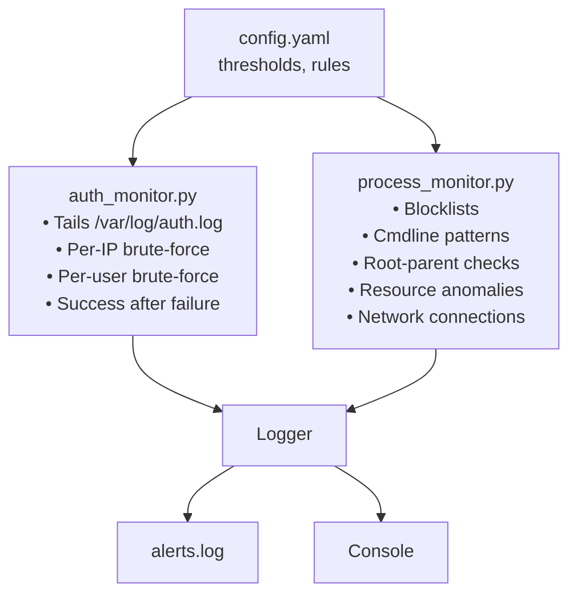

# Simple Intrusion Detection System (HIDS)

[](https://www.python.org/downloads/)
[](https://ubuntu.com/)
[](https://ubuntu.com/)
[](https://opensource.org/licenses/MIT)

A host-based intrusion detection system (HIDS) written in Python. Continuously monitors a Linux host for authentication abuse and suspicious process activity, writing prioritised alerts to a persistent log file.

## Academic Use & Consent

**Strictly for educational purposes** on an isolated VM. Not deployed against third-party systems. Reusers are responsible for ensuring compliance with local laws and policies.

## Table of Contents

- [Project Description](#project-description)
- [Architecture Overview](#architecture-overview)
- [Tech Stack](#tech-stack)
- [Setup & Run](#setup--run-instructions)
- [Screenshots](#screenshots--diagrams)

## Project Description

### Problem It Solves

An unmonitored Linux host is blind to:
- **Brute-force SSH attacks** — most common entry point
- **Distributed attacks** — rotating IPs to evade per-IP rate limits
- **Successful logins after failures** — strongest breach indicator
- **Suspicious processes** — reverse shells, reconnaissance tools, credential attacks
- **Privilege anomalies** — root-owned processes from untrusted parents
- **Resource anomalies** — cryptominers, runaway processes
- **Network anomalies** — outbound connections from shells to external IPs

### Solution

This HIDS:
- Monitors `/var/log/auth.log` and running processes in real time
- Uses signature, threshold, and baseline-based detection
- Writes alerts with timestamps and severity to `alerts.log`
- Fully configurable via `config.yaml` — no code changes needed

## Architecture Overview


```mermaid
flowchart TD
    CFG["config.yaml<br/>thresholds, rules"]
    AUTH["auth_monitor.py<br/>• Tails /var/log/auth.log<br/>• Per-IP brute-force<br/>• Per-user brute-force<br/>• Success after failure"]
    PROC["process_monitor.py<br/>• Blocklists<br/>• Cmdline patterns<br/>• Root-parent checks<br/>• Resource anomalies<br/>• Network connections"]
    LOG["Logger"]
    ALERT["alerts.log"]
    CONSOLE["Console"]
    
    CFG --> AUTH
    CFG --> PROC
    AUTH --> LOG
    PROC --> LOG
    LOG --> ALERT
    LOG --> CONSOLE
```

**Components:**

1. **Auth Monitor** — tails `/var/log/auth.log`, detects per-IP/per-user brute-force, escalates sensitive users to CRITICAL
2. **Process Monitor** — snapshots processes, detects blocklisted binaries, suspicious command lines, root privilege anomalies, resource anomalies, network connections
3. **Config** — single YAML file controls all thresholds and patterns
4. **Alerts** — timestamped, severity-tagged logs to `alerts.log` and console

## Tech Stack

- **Python 3.10+** (tested 3.12.3)
- **psutil** — process monitoring
- **PyYAML** — config parsing
- **Ubuntu 24.04 LTS** — test environment
- **OpenSSH + rsyslog** — auth log source

## Setup & Run Instructions

### Prerequisites
- **Python 3.10+** (tested 3.12.3)
- **Ubuntu 24.04 LTS** (or similar Linux)
- `sudo` access
- `git`

### Installation (5 minutes)

```bash
# 1. Clone
git clone https://github.com/sydykbekova-n-auca-2022/infosec-final-project.git
cd infosec-final-project

# 2. Install system packages
sudo apt update
sudo apt install -y python3.12-venv openssh-server rsyslog
sudo systemctl enable --now ssh rsyslog

# 3. Create virtual environment
python3 -m venv venv
source venv/bin/activate

# 4. Install Python dependencies
pip install -r requirements.txt

# 5. Verify
python3 -c "import psutil, yaml; print('✓ Success')"
```

### Running the IDS

**Quick start (recommended):**
```bash
./run_all.sh
```
Starts both monitors and tails alerts. Press `Ctrl+C` to stop.

**Manual start (3 terminals):**

Terminal 1:
```bash
source venv/bin/activate
sudo venv/bin/python3 auth_monitor.py
```

Terminal 2:
```bash
source venv/bin/activate
python3 process_monitor.py
```

Terminal 3:
```bash
tail -f alerts.log
```

### Configuration

Edit `config.yaml` to tune detection (no code changes needed):

```yaml
auth:
  ip_threshold: 3              # Alert after N failed logins (default: 5)
  ip_window_seconds: 30        # Within N seconds (default: 60)
  cooldown_seconds: 30         # Repeat alert every N seconds (default: 600)

process:
  cpu_threshold_percent: 50    # Alert if avg CPU > N% (default: 80)
  memory_threshold_mb: 300     # Alert if avg mem > N MB (default: 500)

console_level: DEBUG           # Show DEBUG+ on console (default: INFO)
```

Restart monitors to apply changes.

### Quick Test

While `./run_all.sh` is running, open another terminal:

```bash
# Trigger BLOCKLISTED BINARY alert
nc -h

# Trigger BRUTE-FORCE alert (6 failed SSH attempts)
for i in {1..6}; do
  ssh -o ConnectTimeout=2 nur@localhost 2>&1 && sleep 1
done

# Trigger SUSPICIOUS CMDLINE alert
bash -i
exit

# View alerts
grep "CRITICAL\|WARNING" alerts.log
tail -f alerts.log
```

### Troubleshooting

| Problem | Solution |
|---------|----------|
| `ModuleNotFoundError: psutil` | `source venv/bin/activate && pip install -r requirements.txt` |
| `venv/ not found` | `python3 -m venv venv` in project directory |
| `sudo: venv/bin/python3: command not found` | Ensure you're in project directory; use full path |
| `No auth events` | `sudo systemctl restart rsyslog && ls -la /var/log/auth.log` |
| `grep: /var/log/auth.log: binary file matches` | Use `grep -a` flag instead |

## Screenshots & Diagrams

Add screenshots to `assets/` folder demonstrating the IDS in action:

1. **IDS running** — `./run_all.sh` with both monitors starting
2. **CRITICAL alerts** — `alerts.log` showing CRITICAL detections
3. **Brute-force detection** — Multiple failed SSH attempts triggering alert
4. **Suspicious process** — Detection of `bash -i` or `nc -h`
5. **Network connection alert** — Outbound connection to external IP
6. **Configuration file** — `config.yaml` showing tunable parameters

Create the folder and add images:

```bash
mkdir -p assets
# Save screenshots in assets/ and reference with: 
```

---

**Author:** Nurkyz Sydykbekova  
**Course:** Information Security — Final Project  
**Language:** Python 3.12  
**License:** Academic Use Only
